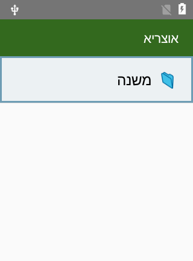
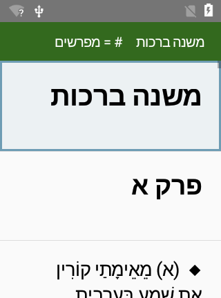
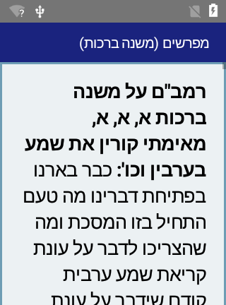
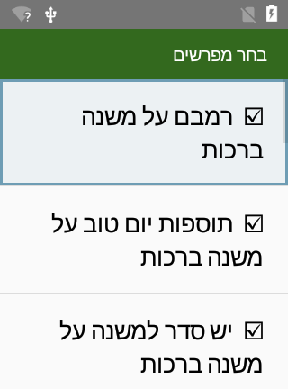

# אוצריא לסוֹנים — Otzaria for Sonim (keypad reader)

A tiny, **non-touch, D-pad-driven** Torah reader for rugged Sonim keypad phones
(**XP5s / XP5800**, Android 7). It reuses the Otzaria library **data as-is** — books
and the meforshim link graph — with a stripped, keypad-first UI. **Reading + meforshim
linking** is the whole point; full-text search is intentionally left out to save space.

It is a native Kotlin app (plain Android Views, zero AndroidX/native libs) → ~850 KB APK,
runs on Android 7+ (minSdk 24), 32-bit or 64-bit. Verified running on a **Sonim XP5800,
Android 7.1.2**.

| Library | Reader (◆ = has meforshim) | Meforshim (stacked) | Choose meforshim (`#`) |
|---|---|---|---|
|  |  |  |  |

---

## How to use it (controls)

Everything is the **D-pad + center (OK) + Back**, plus a couple of number/volume keys.

### Browsing the library
- **Up / Down** — move the highlight.
- **Center (OK)** — open the folder or book.
- **Back** — go up one folder (at the top it exits the app).
- The categories and folders are **exactly the Otzaria structure** — the app just mirrors
  whatever folder tree is on the phone (see *Loading the library* below).
- **MENU key** (on the library screen) — change the library folder path.
- **`#` key** (on the library screen) — an on-device **Help** cheat-sheet of all the
  controls (baked into the APK; English/LTR).

### Reading a book
- **Up / Down** — move through the segments (each pasuk / mishnah / passage is one line).
- A **◆** at the start of a line means **meforshim are available** on that segment
  (for the commentators you've chosen — see next).
- **Center (OK)** on a ◆ line — opens all your chosen meforshim on that segment,
  **stacked in one scroll** (each under its reference). Up/Down scrolls; **Back** returns.
- **Volume Up / Down** — bigger / smaller font (remembered).
- The header shows a **breadcrumb**: `book · chapter · line/total · %`, so you always
  know where you are.

### 👉 Getting around a big sefer (fast navigation)
Large books (a full tractate, ערוך השולחן, בית יוסף…) used to be slow to open and a
chore to scroll. Rows now render lazily and the file is read in the background (the
header shows `טוען…` for a moment on the biggest seforim), and there are two ways to
jump:
- **Type a number `0`–`100`** — jump to that **percent** of the book. The digits show
  **live in the header** as you type; **Center (OK)** jumps there, **Back** cancels and
  leaves you where you were. `0` = the very start, `100` = the end.
- **`*` key — chapter TOC.** Opens the book's headings (perek / siman …) as an indented,
  jump-able list; **Center (OK)** on one scrolls the reader there. Inside the TOC you can
  also **type a number** to jump straight to the **Nth perek/siman** (`#`/`*` clears it).
  Books over ~1,500 lines open **on the TOC first**.
- **Resume** — each sefer reopens **where you left off**.

Nothing on disk is split — the `.txt` files stay byte-identical, so the meforshim link
graph (keyed by filename + line number) is completely unaffected. The "split" is purely
in how the reader *presents* the book.

### 👉 Choosing WHICH meforshim appear  (this is the part that was unclear)
This is a **per-book filter**, just like Otzaria's commentator list.

1. While reading a book, press the **`#` key** (the header shows `# = מפרשים`).
   *(MENU also works. The left soft-key is handled in code but the XP5800 has no
   such key — its keylayout maps neither `SOFT_LEFT` nor `SOFT_RIGHT` — so on that
   unit `#` and MENU are the only two that do anything.)*
2. You get the **בחר מפרשים** ("choose commentators") checklist, in up to three groups:
   - **מפרשים** — the commentaries on this sefer. **On** by default.
   - **הספר שעליו זה מפרש** — if you are reading a commentary, the sefer it comments
     on. **On** by default, so pressing OK on a line of משנה ברורה shows you the
     סעיף it is talking about.
   - **קישורים נוספים** — independent works this sefer merely cross-references.
     **Off** by default.
3. **Up / Down** to move, **Center (OK)** to toggle on/off (☑ ↔ ☐), **Volume ±** resizes.
4. **Back** — saves your choice and returns to the book.

From then on, only the **checked** entries show up: they decide which segments get a
**◆** and what appears when you press OK on a segment. The choice is **saved per book**,
so each sefer remembers its own set — and if a later re-pack adds a commentator to that
sefer, the new one appears checked rather than silently staying off.

### Why the groups exist (the meforshim used to be wrong)
Otzaria's link graph labels an edge `commentary` and **does not say which end is the
commentary** — and it stores nearly every edge **twice, once each way**. Measured over
the whole corpus: of 3.57 M commentary/targum edges whose target is on the shelf, 43.7%
are the *mirror* of another edge. Reading the graph naively, as this app did and as
Otzaria's own Flutter app still does (`getAvailableCommentators` filters on the type and
nothing else), produced:

| open… | …and it offered as a "commentator" |
|---|---|
| שולחן ערוך, יורה דעה | **ויקרא**, טור, בן איש חי, ערוך השולחן |
| משנה ברורה | **שולחן ערוך, אורח חיים** |
| רשי על בראשית | **בראשית** |
| מסכת שבת | ריף בבא בתרא, תוספות על בבא בתרא, משך חכמה |

Across the library **6,814 of 14,058** book↔commentator pairs were not commentaries on
the book offering them — 48%.

The direction is not guessed from the title (`X על Y` would attach `רשי על ברכות` to the
Yerushalmi masechta of the same name). It is **read** from Sefaria's own per-work
`dependence` / `base_text_titles`, the same declaration Girsa's `girsa-link::orient`
uses, rewritten against Otzaria's filenames into **`tools/base_texts.json`** (checked in;
regenerate with `tools/build_bases.py`). See `tools/linkkind.py` for the four rules and
the 30-case self-test.

Nothing is deleted. A link that is not a commentary is **relabelled**, and shows under
its own heading.

---

## Loading the library onto the phone

The phone reads a **packed** library, built on the PC by `tools/pack_library.py`:

```
/storage/emulated/0/Otzaria/
├─ אוצריא/       ← the text tree (categories → books .txt).  KEEP THE STRUCTURE.
└─ idx/          ← one <BookName>.idx per book: the meforshim sidecar
```

```powershell
python tools\pack_library.py --out D:\packed --categories תנך משנה הלכה
python tools\verify_idx.py D:\packed      # checks it before it goes near the phone
```

`verify_idx.py` re-derives everything from the bytes on disk — it does not reuse the
packer's structures — and now also asserts what each link *is*, e.g. that ויקרא is not
a מפרש on שולחן ערוך יורה דעה.

Source data on the PC: `Downloads/otzaria_latest/` (the `.txt` tree + `links/`).

### Why a packer, and not the raw `links/` JSON
The app used to answer *"which lines of this sefer have meforshim?"* by parsing the
whole `<Book>_links.json`. For שולחן ערוך אורח חיים that is **72.4 MB** against this
phone's 192 MB heap, so the app died with an `OutOfMemoryError` before drawing a row —
along with בראשית, שמות, דברים, תהילים and שולחן ערוך חושן משפט.

The packer splits the two questions the reader actually asks:

| | before | after |
|---|---|---|
| open a book (draw the ◆) | parse 72.4 MB | **read 49 KB** |
| press OK on one line | the same 72.4 MB | one seek |
| links on disk | 166 MB of JSON | 12.4 MB of `.idx` |

It also drops any link whose target book is not on the phone, so a ◆ can no longer
open to `אין מפרשים`, and strips Sefaria's inline `<i data-commentator>` anchors —
48% of שולחן ערוך's bytes — which also makes phrases like `יתגבר כארי` contiguous
again.

### ⚠️ Preserve the folder structure
The categories you see are just the folders. Copy Otzaria's tree **intact** — do **not**
flatten it. There's an `adb push` gotcha: pushing a subfolder *into an existing folder*
drops a level. Push each **category** to a matching path, e.g.:

```powershell
# adb from PowerShell (Git Bash mangles the /storage/... paths — use PowerShell)
$adb = "$env:LOCALAPPDATA\Android\Sdk\platform-tools\adb.exe"
cd C:\Users\Administrator\Downloads\otzaria_latest

# one category, structure preserved (note the explicit ...\<Category> on the remote side):
& $adb push "אוצריא\משנה"       "/storage/emulated/0/Otzaria/אוצריא/משנה"
& $adb push "אוצריא\תנך"        "/storage/emulated/0/Otzaria/אוצריא/תנך"
& $adb push "אוצריא\תלמוד בבלי" "/storage/emulated/0/Otzaria/אוצריא/תלמוד בבלי"
& $adb push "אוצריא\הלכה"       "/storage/emulated/0/Otzaria/אוצריא/הלכה"
# ...and any other categories you want (Rambam/Tur/Beis Yosef live under הלכה).
```

Or, to get the **entire** Otzaria structure in one shot (large — the full tree is ~4 GB of
text; pick a subset to stay near your ~1.4 GB budget):

```powershell
& $adb push "אוצריא" "/storage/emulated/0/Otzaria/אוצריא"
```

### ⚠️ Sidecar version — push the APK first
The `.idx` format is at **v2** (it gained one byte per commentator: what that book *is*
to this one). A **v1** sidecar still opens under the new APK — everything in it reads as
a commentary, exactly what v1 claimed — so an out-of-date library degrades to the old
behaviour rather than breaking. The other way round does not: a **v2** sidecar under an
old APK is refused and the book shows no meforshim at all. **Install the APK, then push
`idx/`.**

### Sidecars
Don't push `links/` at all — the phone no longer reads it. `pack_library.py` writes
both `אוצריא/` and `idx/` into its `--out` folder, already consistent with each other:
it ships every commentary target the chosen books reference, and indexes only links
whose target it shipped. Push the packed folder, not the raw corpus:

```powershell
& $adb push "D:\packed\אוצריא" "/storage/emulated/0/Otzaria/אוצריא"
& $adb push "D:\packed\idx"    "/storage/emulated/0/Otzaria/idx"
```

### First run
```powershell
& $adb install -r "app\build\outputs\apk\debug\app-debug.apk"
& $adb shell pm grant com.otzaria.sonim android.permission.READ_EXTERNAL_STORAGE
```
Launch **אוצריא** from the phone's app menu. If it says the folder isn't found, press
**MENU** on the library screen and set the path.

---

## Building the APK

Everything needed is on this PC (Android Studio, SDK, adb, a connected device).

**Android Studio:** open the `OtzariaSonim` folder, let it sync, Run.

**Command line (PowerShell):**
```powershell
cd C:\Users\Administrator\Videos\OtzariaSonim
$env:JAVA_HOME = "C:\Program Files\Android\Android Studio\jbr"
.\gradlew.bat assembleDebug
# APK -> app\build\outputs\apk\debug\app-debug.apk
```
Config: AGP 8.11.1 · Kotlin 2.0.21 · Gradle 8.14.3 · compileSdk 36 · **minSdk 24**.

---

## How it works (for future me)

Plain files, no database. See **`SPEC.md`** for the verified data format and rules.

- `tools/build_bases.py` → `tools/base_texts.json` — which sefer is a commentary on which,
  read off Sefaria's `dependence` / `base_text_titles` and rewritten against Otzaria's
  filenames. Checked in; only needed to regenerate. `tools/linkkind.py` turns that into
  the per-link answer and self-tests with `python tools/linkkind.py`.
- `Otzaria.kt` — data layer. Reads books line-by-line and opens `idx/<Book>.idx`, whose
  per-commentator bitmap answers *"which lines get a ◆"* from a small fixed read and
  whose line directory makes *"what is on line N"* a seek. Target paths are stored in
  the sidecar, so there is no `filename → path` scan at runtime (that scan used to cost
  4.7 s on the first meforshim lookup of every session). Also parses `<h1..6>` headings
  for the TOC. Caches are **bounded** (LRU by character budget) and commentary targets
  over ~2 MB are **streamed one line at a time**, so opening meforshim never loads a
  34 MB file whole. A missing or corrupt sidecar means *no meforshim*, never a crash.
- `LibraryActivity` — folder-tree browser.
- `ReaderActivity` — one segment per row (RTL), ◆ marks segments with meforshim from the
  chosen commentators; `#`/MENU opens the picker; Volume ± = font; **typing a number
  0–100 jumps to that percent** (shown live in the header, OK jumps / Back cancels),
  **`*` opens the chapter TOC**, and it **remembers your last place** per book. Rows
  are rendered **lazily** (see `ReaderAdapter` in `Ui.kt`) — row N is always file line
  N+1, so line indices (and links) never move. The book is read **off the main thread**
  (the header shows `טוען…` until it lands), because ערוך השולחן is 31 MB / 26,776 lines
  and reading that in `onCreate` is an ANR waiting for a slower card.
- `TocActivity` — the chapter TOC: `Otzaria.headings()` parses the `<h1..6>` headings into
  an indented, jump-able list (the "virtual split"). Auto-picks the primary heading level
  (perek / siman) for the type-a-number jump.
- `CommentatorsActivity` — the per-book ☑/☐ filter, grouped into מפרשים / the sefer this
  one comments on / other cross-references, from the sidecar's per-commentator kind byte.
  The choice is persisted per book title **together with the roster it was made against**,
  so a later re-pack that adds a commentator shows it checked rather than silently off.
- `HelpActivity` — an on-device controls cheat-sheet (English/LTR), reached with `#` from
  the library. The text is baked into the class, rendered with the same `<h1>/<b>` renderer.
- `CommentaryActivity` — the chosen meforshim on one segment, stacked.
- `Ui.kt` — `RowAdapter` (the shared RTL, adjustable-size list adapter) + the minimal
  `<h1>/<h2>/<h3>/<b>` → `Html.fromHtml` renderer used by every screen.
- `Settings.kt` — persisted font size and per-book commentator selection.

- `Settings.kt` — font size, per-book commentator selection, and the last place. A saved
  place is a **line number into a library you re-download**, so it is stored with the
  first 40 characters of the line it pointed at: on reopen the text is checked, and if it
  moved the reader scans ±200 lines to find it again. Only when that fails does it go to
  the top — and then it *says so*, because a reader silently dropped 300 lines from where
  they stopped concludes the app loses their place at random.

### Backlog
- Optional: mount the larger **org** corpus as read-only books (no meforshim).
- A "recently read" list on the library screen (the per-book last-place is already stored).
- ~~`base_texts.json` misses 933 Otzaria-only books~~ — **checked, and it is not a gap
  worth work.** 891 of the 933 have no links at all, so they never reach a picker. The
  42 that do are two families (38 × `חברותא על <מסכת>`, 4 × `הערות על שות הרשבא`), and
  every edge touching one is `הערות על חברותא על X` → `חברותא על X`, where "commentary"
  is the right answer anyway. `pack_library.py` now prints the share of links decided on
  **no evidence**: it is **39 pairs, 0.3%**. Watch that number; do not assume it.
  Otzaria's own `metadata.json` covers 0 of the 42, and `hebrew_books.csv` /
  `otzar_books.csv` are printing-house catalogues with no base-text field — so
  otzaria-main has nothing to add here either.
- Swap the packer's link *source* to Girsa's corpus once its graph is unioned; the
  `.idx` format doesn't change. `tools/girsa_coverage.py` now reports **82%** commentator
  coverage on a 12-book sample, not the 33% previously quoted — that figure was an
  artefact of the tool bucketing every Bavli commentary under `bavli` (BUILDER.md S1).

*(Done: lazy big-book loading, chapter TOC, %-jump, resume-last-place, the binary
links index, off-main-thread book loading, meforshim link-kind classification,
self-verifying bookmarks, BOM-tolerant heading parsing, font size in the picker,
spoken names for the ◆/☑/📁 glyphs.)*
